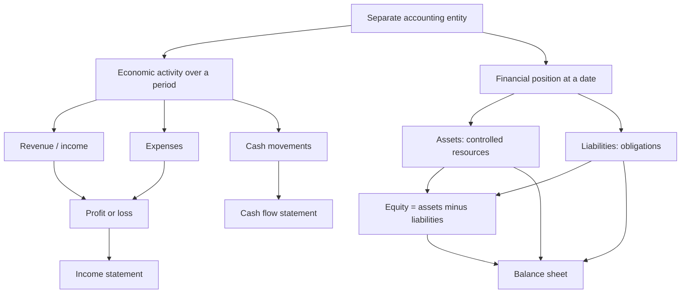

# Lesson 01 — What is a company financially?

Status: prepared for next session, not taught yet.

## Purpose

Build the first pure-finance mental model: before statements, dashboards, KPIs, or systems, understand what a company is financially.

By the end, the learner should be able to say:

> Financially, a company is an economic entity that earns, spends, owns, owes, and is financed. Accounting organizes those facts into structured statements so people can judge performance, financial position, and cash generation.

## Lesson 1 core unconditional truths and definitions

These are the non-negotiable foundations to teach and quiz before moving on.

1. **A company is treated as a separate accounting entity.**  
   Its financial records distinguish the company from its owners, employees, customers, and suppliers. Even if an owner controls the company, the company’s assets, obligations, revenues, and expenses are accounted for separately.

2. **Financially, a company has economic activity and a financial position.**  
   Activity happens over a period: selling, buying, employing people, producing, borrowing, investing. Position exists at a point in time: what the company controls, what it owes, and the owners’ residual claim.

3. **The basic balance-sheet logic is: assets = liabilities + equity.**  
   A company’s resources are financed either by outsiders’ claims/liabilities or owners’ residual claim/equity. Equivalent form: equity = assets − liabilities.

4. **An asset is not “anything valuable”; it is a present economic resource controlled by the company.**  
   The key tests are control and expected future economic benefit. Cash, receivables, inventory, equipment, and certain rights can be assets. A skilled employee is valuable, but usually not an asset on the balance sheet because the company does not control the person as an economic resource.

5. **A liability is not “any bad thing”; it is a present obligation to transfer an economic resource.**  
   Loans, trade payables, tax payable, and obligations to deliver goods/services already paid for can be liabilities. A future ambition to spend money is not automatically a liability.

6. **Equity is the residual interest after liabilities.**  
   Equity is not the same as cash in the bank. It is the owners’ claim on net assets: assets minus liabilities. It includes contributed capital and accumulated profits retained in the business, subject to accounting rules.

7. **Revenue is income from ordinary activities, not necessarily cash received.**  
   A company can recognize revenue before collecting cash, at the same time as collecting cash, or after collecting cash depending on the transaction and recognition rules.

8. **An expense is a cost recognized in profit or loss, not necessarily cash paid.**  
   Paying cash and recognizing an expense can happen in different periods. Example: equipment purchase may first create an asset, then depreciation expense over time.

9. **Profit is not cash.**  
   Profit measures accounting performance over a period: income minus expenses. Cash measures liquidity and actual cash movements. A profitable company can run out of cash; a cash-positive period can still be unprofitable.

10. **The three core statements answer different questions.**
    - Balance sheet / statement of financial position: What does the company control and owe at a date?
    - Income statement / profit or loss: Did it generate accounting profit over a period?
    - Cash flow statement: What cash came in and went out over a period?

11. **Accounting is a structured representation, not the business itself.**  
    Financial statements simplify reality using recognition, measurement, classification, and presentation rules. They are useful because they are disciplined, not because they capture every form of value.

## Recommended teaching sequence for this lesson

1. **Entity boundary** — company separate from owner and stakeholders.
2. **Five verbs** — earns, spends, owns, owes, is financed.
3. **Point-in-time vs period** — position vs performance/cash movements.
4. **Assets, liabilities, equity** — the accounting equation.
5. **Revenue, expense, profit** — performance language.
6. **Cash vs profit** — why survival and performance are different questions.
7. **Statement map** — where each idea will appear later.

## Common misconceptions to probe with quiz questions

Use these as diagnostic questions before and after teaching.

| Misconception | Probe question | Correct target answer |
|---|---|---|
| Revenue means cash collected. | A consulting firm invoices €100k in December, cash due in February. Did it necessarily receive cash in December? Could it still have revenue? | It may have revenue without cash collection, depending on revenue recognition; cash collection is separate. |
| Profit means cash increased. | A company reports €50k profit but customers have not paid yet. Can cash be flat or down? | Yes. Profit includes non-cash timing effects; receivables can increase while cash does not. |
| Buying equipment is immediately an expense. | A company pays €30k for a machine used for 5 years. Is the full €30k necessarily this month’s expense? | Usually no. It may be capitalized as an asset and depreciated over useful life. |
| Assets are simply “things with value.” | Is a talented employee an asset on the balance sheet? | Usually no, because the company does not control the person as an economic resource in the accounting sense. |
| Liabilities are just “bad costs.” | Is a customer prepayment a liability? | Often yes: the company may owe goods/services or a refund, even though cash was received. |
| Equity equals cash. | A company has €1m equity and €20k cash. Is that impossible? | No. Equity is residual net assets, not cash. Assets may be inventory, receivables, equipment, etc. |
| A company with positive cash flow is healthy. | A company borrows €1m and burns money operationally. Cash increased. Is the business necessarily performing well? | No. Financing cash inflow can hide operating losses or weak performance. |
| A balance sheet covers a period. | Does a balance sheet describe January activity or the position on 31 January? | It describes financial position at a point in time. |
| The income statement shows everything the company owns. | Where would a bank loan appear: income statement or balance sheet? | Balance sheet as a liability; interest expense appears in the income statement. |
| Expenses are the same as payments. | Salaries earned in December but paid in January: can December have an expense? | Yes, under accrual accounting the expense can be recognized when incurred. |

## Initial probe candidates

Ask orally or as a mini-quiz:

1. Can a company be profitable and still run out of cash? Explain in one sentence.
2. Is revenue the same as cash received?
3. Is buying equipment immediately an expense?
4. What is the difference between owning something and owing something?
5. What does profit measure that cash does not?
6. What does the balance sheet show that the income statement does not?

## Candidate dependency map

## Things to avoid in this lesson

- Do not frame finance as a data model yet.
- Do not introduce star schemas, dbt, semantic layers, or dashboards.
- Do not jump to advanced KPIs.
- Do not mix accounting vocabulary before the underlying idea is solid.
- Do not imply accounting definitions are casual everyday definitions; they are rule-based.

## Sources used for terminology

- IFRS Foundation, *Conceptual Framework for Financial Reporting*: used for the objective of financial reporting and definitions of elements such as asset, liability, equity, income, and expenses. <https://www.ifrs.org/issued-standards/list-of-standards/conceptual-framework/>
- IAS Plus summary of IAS 1, *Presentation of Financial Statements*: used to verify IFRS statement names, accrual basis, and the complete set of financial statements. <https://www.iasplus.com/en/standards/ias/ias1>
- OpenStax, *Principles of Accounting, Volume 1*: used as an accessible cross-check for accounting equation and introductory accounting terminology. <https://openstax.org/details/books/principles-financial-accounting>
