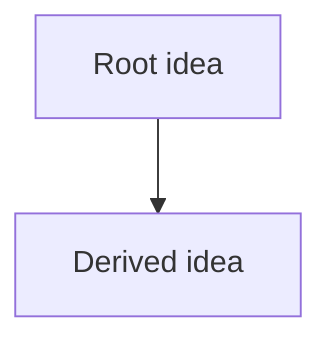

# Lesson title

Status: draft / in progress / complete

## Purpose

What this lesson is meant to make understandable.

## Probe

Questions used to locate the current understanding edge.

## Plan

Short explanation of the teaching route.

## Lesson notes

Captured during the session.

## Checks

Quiz/checkpoint questions and results.

## Summary

The compressed mental model after the lesson.

## Open questions

What remains unclear or should be revisited.
